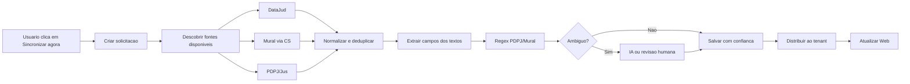
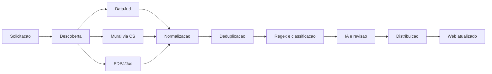

# Motor Unificado de Extracao do MeuJudi

## 1. Objetivo

O MeuJudi Web deve apresentar uma unica experiencia de sincronizacao. O usuario
clicara em **Sincronizar agora** e nao precisara saber se os dados vieram do
DataJud, do Mural consultado pelo MeuJudi CS ou do Portal PDPJ/Jus.

Por tras dessa acao existira um motor de orquestracao que executa as consultas,
normaliza os resultados, remove duplicidades, extrai informacoes dos textos e
entrega ao tenant uma visao consolidada.

As fontes previstas para esta implementacao sao somente:

- DataJud;
- Mural, consultado localmente pelo MeuJudi CS;
- Portal PDPJ/Jus.

PJe nao faz parte deste fluxo.

## 2. Principios da arquitetura

### 2.1 Uma solicitacao para o usuario

O Web cria uma solicitacao unica de sincronizacao. Os adaptadores internos
consultam cada fonte conforme a disponibilidade do tribunal, da sessao e do
CS pareado.

### 2.2 Adaptadores independentes

Cada fonte implementa a mesma interface interna:

```ts
interface FonteExtracao {
  consultarProcessos(contexto: ContextoConsulta): Promise<ResultadoFonte>;
  consultarProcesso?(contexto: ContextoProcesso): Promise<ResultadoFonte>;
  verificarSaude(): Promise<SaudeFonte>;
}
```

Adaptadores:

- `DataJudAdapter`: consulta a API publica do DataJud;
- `MuralCsAdapter`: cria uma fila para o CS consultar localmente;
- `PdpjAdapter`: usa a sessao autenticada do CS e consulta processos,
  movimentacoes e documentos pelo PDPJ.

O restante do sistema nao deve chamar endpoints especificos dessas fontes
diretamente. Ele conversa com o motor unificado.

### 2.3 Resultado canonico

Todos os adaptadores convertem suas respostas para objetos comuns:

- processo;
- movimentacao;
- comunicacao;
- documento;
- parte;
- advogado;
- prazo;
- audiencia;
- fonte original;
- evidencia;
- nivel de confianca.

Cada dado deve manter sua origem. Unificar a experiencia nao significa apagar
de onde a informacao veio.

## 3. Fluxo geral



## 4. Estados da sincronizacao

Uma sincronizacao deve ter estado geral e estado por etapa.

### Estado geral

- `queued`: criada e aguardando processamento;
- `running`: pelo menos uma etapa em execucao;
- `paused_login_required`: depende de login ou sessao do CS;
- `completed`: concluida sem falha bloqueante;
- `completed_with_warnings`: concluida com uma ou mais fontes incompletas;
- `failed`: falha que impediu a conclusao;
- `cancelled`: cancelada manualmente.

### Estado de cada etapa

- `pending`;
- `running`;
- `waiting_external`: aguardando CS, rate limit ou resposta de fonte;
- `paused`;
- `completed`;
- `warning`;
- `failed`;
- `skipped`.

Uma falha no Mural nao deve apagar os resultados obtidos pelo DataJud. O motor
deve concluir como `completed_with_warnings` e explicar exatamente qual fonte
nao respondeu.

## 5. Fases de implementacao

### Fase 0 - Contrato e inventario

- Definir o formato canonico dos resultados.
- Mapear quais campos ja existem em `processos`, `movimentacoes` e
  `comunicacoes_mural`.
- Definir o que e dado estruturado, texto livre e documento.
- Definir regras de precedencia entre fontes.
- Registrar que nenhuma etapa de PJe sera criada.

**Saida:** contrato TypeScript, matriz de campos e regras de precedencia.

### Fase 1 - Registro da solicitacao

Criar uma solicitacao por sincronizacao, contendo:

- tenant;
- usuario ou origem que iniciou;
- tipo: completa, individual ou cron;
- processo ou OAB alvo, quando aplicavel;
- periodo consultado;
- status;
- inicio, fim e ultima atividade;
- resumo de resultados;
- erro geral, se houver.

**Saida:** o Web consegue acompanhar uma sincronizacao mesmo depois de
recarregar a pagina.

### Fase 2 - Registro das etapas

Cada solicitacao tera etapas filhas:

- descoberta de fontes;
- consulta DataJud;
- consulta Mural via CS;
- consulta PDPJ;
- normalizacao;
- deduplicacao;
- extracao Regex;
- extracao IA;
- distribuicao ao tenant;
- finalizacao.

Cada etapa deve registrar:

- inicio e fim;
- status;
- quantidade lida;
- quantidade nova;
- quantidade atualizada;
- quantidade ignorada;
- quantidade duplicada;
- quantidade com erro;
- mensagem tecnica segura;
- ultimo cursor ou pagina processada;
- tentativa atual e proxima tentativa.

### Fase 3 - Orquestrador

- Criar o servico que inicia e continua uma solicitacao.
- Executar fontes independentes quando possivel.
- Permitir retomada apos queda ou expiracao de sessao.
- Usar idempotencia para nao duplicar movimentacoes e documentos.
- Aplicar retry com espera progressiva para erros temporarios.
- Separar erro de autenticacao, rate limit, indisponibilidade e dado invalido.

O orquestrador deve persistir o progresso antes de iniciar cada lote. Assim,
uma interrupcao retoma do ultimo ponto salvo.

### Fase 4 - Adaptador DataJud

- Reutilizar a consulta atual por tribunal.
- Normalizar CNJ, classe, assunto, orgao e movimentacoes.
- Gravar movimentacoes novas sem apagar as anteriores.
- Preservar codigo, nome, data, complementos e texto completo.
- Atualizar indicadores do processo.

### Fase 5 - Adaptador Mural via CS

- Criar uma solicitacao para o CS pareado.
- Exibir `waiting_external` enquanto o CS consulta localmente.
- Aceitar lotes e retomada apos reinicio do CS.
- Receber comunicacoes, prazos, audiencias e advogados.
- Rejeitar itens sem vinculo confirmado com algum tenant.
- Registrar a pagina, periodo e OAB consultados.

### Fase 6 - Adaptador PDPJ/Jus

- Usar somente a sessao autenticada no CS.
- Consultar processos por OAB ou CNJ.
- Controlar cursor e paginacao.
- Pausar com `paused_login_required` quando a sessao expirar.
- Consultar detalhes, movimentacoes e documentos.
- Salvar links de texto e PDF sem baixar automaticamente todos os binarios.
- Registrar falhas por documento sem interromper os demais.

### Fase 7 - Normalizacao e deduplicacao

Normalizar antes de comparar:

- CNJ com e sem pontuacao;
- tribunal e sigla;
- nomes de classes;
- nomes de partes;
- advogados e OAB;
- datas e fusos;
- identificadores de movimentacao;
- identificadores de documentos.

Uma movimentacao igual encontrada no DataJud e PDPJ deve virar um registro
canonico com duas fontes, e nao duas movimentacoes visuais duplicadas.

### Fase 8 - Extracao de textos

Aplicar em ordem:

1. Dados estruturados da fonte;
2. Regex especifico do formato da fonte;
3. Regex generico;
4. IA para texto ambiguo;
5. Revisao humana quando a confianca for baixa.

Para documentos PDPJ, extrair inicialmente:

- tipo do documento;
- classe;
- assunto;
- valor da causa;
- orgao julgador;
- magistrado;
- partes e polos;
- prazos;
- audiencias;
- decisoes e comandos praticos;
- pagamentos, penhora, arrematacao e cumprimento.

Cada extracao deve guardar o trecho que justificou o resultado. A palavra
"audiencia" sozinha nunca deve criar um evento. O motor precisa diferenciar
audiencia futura, realizada, cancelada, retirada de pauta e referencia legal.

### Fase 9 - Distribuicao ao tenant

- Resolver o tenant pelo vinculo confirmado do processo, OAB ou CS.
- Aplicar RLS normalmente no Web.
- Nao distribuir dados sem vinculo.
- Registrar a decisao de roteamento e o motivo.
- Manter a fonte original e a solicitacao de origem.

### Fase 10 - Experiencia do Web

O Web deve mostrar apenas:

- Sincronizar agora;
- Sincronizacao em andamento;
- ultimo resultado;
- avisos de fonte indisponivel;
- dados consolidados.

Os botoes individuais DataJud, Mural e PDPJ ficam restritos a diagnostico,
administracao ou sincronizacao individual de um processo.

### Fase 11 - Observabilidade do Super Admin

Criar o painel **Motor de Extracao** em uma area separada do painel do tenant.
O painel tera um fluxograma e paginas de detalhe por etapa.

## 6. Fluxograma do Super Admin

O fluxograma deve ser a primeira tela do motor. Ele mostra somente o estado
operacional de cada bloco, sem despejar logs tecnicos na tela principal.



### Estado visual dos blocos

Cada bloco mostra apenas:

- verde: funcionando;
- azul: em execucao;
- amarelo: aguardando, com alerta ou parcialmente concluido;
- vermelho: erro;
- cinza: nao executado ou desabilitado.

O bloco deve conter um resumo pequeno:

- ultima execucao;
- duracao;
- status atual;
- quantidade processada;
- alerta principal.

Nao exibir tokens, cookies, texto integral de documentos ou dados sensiveis no
fluxograma.

### Clique em um bloco

Ao clicar em qualquer etapa, abrir uma rota propria, por exemplo:

- `/admin/extracao/solicitacao/:id`;
- `/admin/extracao/etapa/datajud`;
- `/admin/extracao/etapa/mural-cs`;
- `/admin/extracao/etapa/pdpj`;
- `/admin/extracao/etapa/normalizacao`;
- `/admin/extracao/etapa/regex`;
- `/admin/extracao/etapa/distribuicao`.

## 7. Pagina de detalhe de cada etapa

Todas as paginas devem seguir o mesmo modelo.

### Resumo operacional

- status atual;
- saude da etapa;
- ultima execucao;
- proxima execucao;
- tempo medio;
- taxa de sucesso;
- quantidade pendente;
- quantidade com alerta;
- dependencias indisponiveis.

### Historico de consultas

Tabela paginada com:

- data e hora;
- tenant;
- tribunal;
- tipo de solicitacao;
- periodo consultado;
- status;
- duracao;
- lidos;
- novos;
- atualizados;
- duplicados;
- erros;
- link para detalhes.

### Execucao individual

Ao abrir uma consulta especifica, mostrar uma linha do tempo:

```text
Solicitacao criada
Fonte autenticada
Lote 1 iniciado
Lote 1 concluido
Documento processado
Regex aplicada
Registro consolidado
Tenant atualizado
```

### Erros e alertas

Cada erro deve ter:

- categoria;
- etapa;
- codigo tecnico;
- mensagem amigavel;
- tentativa atual;
- quantidade afetada;
- proxima acao recomendada;
- possibilidade de reprocessar.

## 8. Informacoes especificas por etapa

### DataJud

- tribunais consultados;
- chave presente ou ausente, sem exibir o valor;
- tempo de resposta;
- HTTP status;
- paginas e processos;
- processos novos e atualizados;
- movimentacoes inseridas;
- tribunais sem resposta.

### Mural via CS

- CS pareado;
- ultima atividade do CS;
- OAB consultada;
- periodo;
- lote atual;
- fila pendente;
- paginas consultadas;
- comunicacoes recebidas;
- itens descartados por falta de tenant;
- sessao expirada;
- ultima mensagem de erro.

### PDPJ/Jus

- sessao valida ou expirada;
- OAB ou CNJ consultado;
- paginas e cursor;
- processos encontrados;
- movimentacoes encontradas;
- documentos encontrados;
- textos lidos;
- PDFs disponiveis;
- documentos que falharam;
- HTTP 403, 404, 429 e 5xx;
- ultima pagina processada.

### Regex e IA

- textos recebidos;
- Regex aplicadas;
- campos encontrados;
- campos sem correspondencia;
- confianca alta, media e baixa;
- chamadas de IA;
- itens enviados para revisao;
- custo estimado;
- Regex com maior taxa de falha.

### Distribuicao

- itens roteados por tenant;
- itens descartados;
- motivo do descarte;
- conflitos entre fontes;
- duplicidades removidas;
- processos atualizados;
- auditoria de cada decisao.

## 9. Persistencia e seguranca

As tabelas do motor devem ser protegidas por RLS. O Super Admin acessa os
resumos globais, mas o texto sensivel deve ter acesso controlado e auditado.

Registros recomendados:

- `extraction_requests`;
- `extraction_steps`;
- `extraction_events`;
- `extraction_errors`;
- `process_documents`;
- `document_extractions`.

Os registros devem possuir `tenant_id` quando forem vinculados a um escritorio.
Dados globais de saude e metricas podem ficar separados de dados processuais.

Nunca salvar tokens, cookies ou chaves em logs. URLs de documentos devem ser
tratadas como dados potencialmente sensiveis.

## 10. Criterios de aceite

- O usuario inicia uma unica sincronizacao no Web.
- DataJud, Mural e PDPJ aparecem como fontes internas, nao como fluxos separados.
- Uma falha de uma fonte nao apaga resultados das outras.
- A sincronizacao continua apos recarregar a pagina.
- O Super Admin visualiza o fluxograma em tempo real.
- Cada bloco abre uma pagina de detalhe.
- Cada etapa possui historico paginado.
- Erros mostram causa e proxima acao.
- O motor evita duplicidades entre DataJud, Mural e PDPJ.
- Regex PDPJ salva evidencia e confianca.
- Audiencias historicas nao viram compromissos futuros automaticamente.
- Itens sem tenant sao descartados e auditados.
- Nenhuma credencial aparece no Web ou no painel.

## 11. Ordem recomendada de execucao

1. Contrato canonico e matriz de precedencia.
2. Tabelas de solicitacao, etapas e eventos.
3. Orquestrador com progresso persistente.
4. Adaptador DataJud.
5. Adaptador Mural via CS.
6. Adaptador PDPJ/Jus.
7. Normalizacao e deduplicacao.
8. Regex especifico dos documentos PDPJ.
9. Persistencia de documentos e evidencias.
10. Integracao com prazos, audiencias e revisao humana.
11. Fluxograma do Super Admin.
12. Paginas de detalhe e historico.
13. Testes com os tres provedores e processos reais anonimizados.
