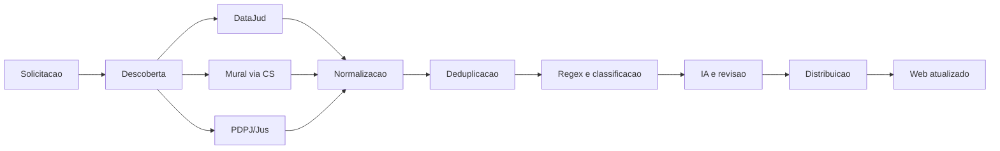

# Politica de Sincronizacao Unificada do MeuJudi

## 1. Objetivo

O MeuJudi deve parecer, para o advogado, um sistema que consulta uma unica
fonte de informacoes processuais. Internamente, o sistema consulta DataJud,
Mural via MeuJudi CS e Portal PDPJ/Jus, mas essa complexidade nao deve ser
transferida para o usuario.

O objetivo da sincronizacao e manter o escritorio informado sobre:

- novas movimentacoes;
- comunicacoes do Mural;
- prazos;
- audiencias;
- processos novos ou alterados;
- documentos relevantes;
- partes, advogados e dados do processo.

O objetivo principal nao e armazenar o maior volume possivel de dados. E
transformar uma informacao publicada pelo tribunal em uma acao clara para o
escritorio.

## 2. Fontes oficiais do fluxo

O fluxo utiliza somente as fontes abaixo:

- **DataJud:** movimentacoes e metadados processuais estruturados;
- **Mural via MeuJudi CS:** comunicacoes, intimacoes, prazos e audiencias;
- **Portal PDPJ/Jus:** processos, movimentacoes, documentos e textos completos.

PJe nao faz parte deste fluxo.

## 3. Uma sincronizacao para o usuario

No Web existira uma acao principal:

> **Sincronizar agora**

Essa acao cria uma solicitacao unificada. O motor interno inicia as fontes
disponiveis em paralelo:

```text
Sincronizacao unificada
       |
       +-- DataJud
       +-- Mural via CS
       +-- PDPJ/Jus
       |
       +-- Normalizacao
       +-- Deduplicacao
       +-- Regex e IA
       +-- Distribuicao ao tenant
```

Uma fonte lenta nao deve bloquear as outras. O Web pode mostrar resultado
parcial enquanto outra fonte continua trabalhando.

Exemplo:

```text
DataJud: processando 420 de 1.000
PDPJ: concluido
Mural: aguardando MeuJudi CS
Resultado parcial disponivel
```

## 4. Tipos de sincronizacao

### 4.1 Ciclo rapido

Objetivo: identificar rapidamente informacoes novas ou urgentes.

Consulta:

- Mural recente;
- DataJud incremental;
- PDPJ para processos novos ou alterados;
- deteccao inicial de prazos e audiencias.

Frequencia recomendada: **a cada 1 hora**, quando o CS estiver conectado e os
limites da fonte permitirem.

O ciclo rapido nao deve baixar ou reprocessar todos os documentos historicos.

### 4.2 Ciclo operacional

Objetivo: manter os processos ativos do escritorio atualizados.

Consulta:

- DataJud de todos os processos ativos;
- PDPJ dos processos modificados;
- Mural do periodo recente;
- atualizacao de partes, advogados, classe e orgao julgador.

Frequencia recomendada: **a cada 6 horas**.

O processamento deve ocorrer em lotes, salvando o progresso a cada lote.

### 4.3 Ciclo longo

Objetivo: buscar informacoes de maior volume e corrigir diferencas entre fontes.

Consulta:

- documentos do PDPJ;
- textos completos;
- movimentacoes antigas;
- reconciliacao entre DataJud, Mural e PDPJ;
- reprocessamento de Regex;
- deteccao de duplicidades;
- correcao de campos incompletos.

Frequencia recomendada: diariamente, preferencialmente durante a madrugada.

O historico mais antigo e a extracao extensa de documentos podem ser executados
semanalmente.

### 4.4 Sincronizacao individual

Disponivel no modal de um processo.

Ao solicitar a atualizacao individual:

1. consultar o DataJud;
2. solicitar o Mural especifico pelo CS;
3. consultar os detalhes do PDPJ;
4. atualizar cada fonte conforme sua resposta;
5. mostrar a situacao de cada fonte no modal.

O usuario nao deve esperar todas as fontes terminarem para ver o que ja foi
atualizado.

Exemplo:

```text
DataJud: atualizado
PDPJ: atualizado
Mural: aguardando MeuJudi CS
```

## 5. Frequencia por fonte

| Fonte | Ciclo rapido | Ciclo operacional | Ciclo longo |
| --- | --- | --- | --- |
| Mural via CS | 1 hora | periodo recente a cada 6 horas | busca historica diaria ou semanal |
| DataJud | 1 hora para prioritarios | processos ativos a cada 6 horas | reconciliacao diaria |
| PDPJ/Jus | processos novos ou alterados a cada 4-6 horas | detalhes dos ativos | documentos e textos durante a madrugada |
| Documentos PDPJ | somente quando necessario | documentos de processos alterados | historico completo diario/semanal |

Esses tempos sao configuraveis por tribunal e fonte. Se uma fonte aplicar
limite, bloqueio ou instabilidade, o motor deve reduzir a frequencia sem
interromper as demais fontes.

## 6. Tratamento do DataJud

O DataJud pode demorar mais porque precisa consultar muitos processos. Ele nao
deve repetir a consulta completa em todos os ciclos.

Cada processo deve guardar:

- ultima data de atualizacao consultada;
- ultima movimentacao recebida;
- cursor ou pagina, quando houver;
- numero de tentativas;
- proxima tentativa;
- prioridade.

### Fila de lotes

```text
1.000 processos ativos
        |
Lote 1: 100 processos
        |
salvar progresso
        |
Lote 2: 100 processos
        |
salvar progresso
```

Se o processo 437 falhar, o motor deve retomar do lote incompleto, sem perder
os resultados anteriores.

### Prioridades do DataJud

1. Processos com prazo proximo;
2. Processos com audiencia proxima;
3. Processos com nova comunicacao do Mural;
4. Processos recentemente alterados;
5. Demais processos ativos;
6. Processos arquivados ou historicos.

## 7. Tratamento do PDPJ/Jus

O PDPJ deve ser usado em camadas:

### Consulta leve

- localizar processos;
- verificar se houve alteracao;
- consultar quantidade de movimentacoes;
- atualizar metadados principais.

### Consulta detalhada

- consultar movimentacoes completas;
- consultar partes e representantes;
- identificar documentos disponiveis;
- obter links para texto e PDF.

### Consulta pesada

- ler textos dos documentos;
- classificar despachos, decisoes, peticoes e sentencas;
- extrair prazos, audiencias e comandos praticos;
- enviar casos ambiguos para IA ou revisao humana.

Documentos antigos nao devem ser lidos em todos os ciclos. O motor deve buscar
primeiro documentos novos ou vinculados a uma movimentacao recente.

## 8. Tratamento do Mural via CS

O Web cria uma solicitacao e o CS conectado executa a consulta localmente.

O fluxo deve registrar:

- CS pareado;
- OAB consultada;
- periodo consultado;
- lote atual;
- paginas processadas;
- comunicacoes recebidas;
- novos processos;
- processos atualizados;
- itens descartados por falta de vinculo;
- sessao expirada;
- erro retornado pelo tribunal.

O Web nao deve tentar substituir o CS quando a consulta depender da sessao ou
do ambiente local do escritorio.

## 9. Normalizacao e deduplicacao

Antes de salvar os resultados, o motor deve normalizar:

- CNJ com e sem pontuacao;
- siglas de tribunais;
- nomes de classes;
- nomes de partes;
- OAB e UF;
- datas e fusos;
- identificadores de movimentacoes;
- identificadores de documentos.

Se DataJud e PDPJ encontrarem a mesma movimentacao, deve existir um unico
registro visual, com as duas fontes associadas internamente.

## 10. Extracao de informacoes

A ordem de processamento sera:

1. dado estruturado recebido da fonte;
2. Regex especifico do formato da fonte;
3. Regex generico;
4. IA para texto ambiguo;
5. revisao humana quando a confianca for baixa.

Para documentos PDPJ, o Regex deve procurar:

- tipo do documento;
- classe processual;
- assunto principal;
- valor da causa;
- orgao julgador;
- magistrado;
- partes e polos;
- prazos;
- audiencias;
- decisoes;
- pagamentos;
- penhora;
- arrematacao;
- cumprimento de determinacoes.

Cada informacao extraida deve guardar:

- valor final;
- fonte;
- documento ou movimentacao de origem;
- trecho de evidencia;
- Regex ou modelo utilizado;
- nivel de confianca;
- data da extracao.

Uma mencao historica a audiencia nao deve criar um evento futuro. O motor deve
distinguir audiencia designada, redesignada, realizada, cancelada ou retirada
de pauta.

## 11. Atualizacao do modal do processo

### Resumo

O resumo deve priorizar:

- status;
- CNJ;
- classe;
- tribunal e orgao julgador;
- autor e reu;
- advogados;
- cliente vinculado;
- proximo prazo;
- proxima audiencia;
- ultima movimentacao;
- valor da causa;
- fontes atualizadas;
- ultima sincronizacao.

Tambem deve existir uma area clara de acao:

```text
O que aconteceu?
O que precisa ser feito?
Quem e o responsavel?
Qual e o prazo?
```

### Movimentacoes

Todas as movimentacoes permanecem armazenadas, mas nao precisam aparecer de uma
vez.

Na primeira abertura:

- mostrar as 10 ou 20 mais recentes;
- destacar prazos, intimações, decisoes, sentencas e audiencias;
- mostrar data, titulo, texto resumido e fonte;
- permitir abrir o texto completo.

Depois, permitir:

- carregar mais;
- paginar;
- filtrar por periodo;
- filtrar por fonte;
- filtrar por tipo;
- pesquisar no historico.

### Mural

O texto precisa ser convertido para uma apresentacao legivel:

- remover tags HTML;
- converter tabelas em blocos;
- separar cabecalho e conteudo;
- destacar datas, prazos e acoes;
- manter o texto original em uma area tecnica.

### Documentos

Mostrar:

- nome;
- tipo;
- data;
- origem;
- sigilo;
- link para visualizar ou baixar;
- indicacao de documento relevante;
- resumo extraido quando existir.

Os PDFs nao devem ser baixados automaticamente em massa. O sistema pode manter
o link e baixar o arquivo apenas quando necessario para extracao ou visualizacao.

### Agenda

Mostrar somente eventos vinculados ao processo:

- prazos;
- audiencias;
- tarefas geradas;
- responsavel;
- status;
- origem;
- link de videoconferencia.

## 12. Resultado parcial e atualizacao visual

O Web deve mostrar o estado de cada fonte, sem travar a tela:

```text
DataJud: processando
PDPJ: concluido
Mural: aguardando CS
```

Quando uma fonte terminar, o resultado deve atualizar o modal e os indicadores
sem exigir que o usuario repita a consulta.

O resultado geral pode ser:

- concluido;
- concluido com avisos;
- aguardando CS;
- aguardando login;
- parcialmente concluido;
- falhou.

Uma falha no DataJud nao deve apagar dados do PDPJ ou do Mural. Uma falha no
Mural nao deve impedir a atualizacao do DataJud.

## 13. Super Admin e observabilidade

O Super Admin tera uma area separada chamada **Motor de Extracao**.

### Fluxograma principal



O fluxograma mostra somente a saude operacional:

- verde: funcionando;
- azul: em execucao;
- amarelo: alerta ou espera;
- vermelho: erro;
- cinza: nao executado.

Ao clicar em um bloco, abrir uma pagina especifica da etapa.

### Historico por etapa

Cada etapa deve mostrar:

- ultima execucao;
- tempo medio;
- taxa de sucesso;
- quantidade pendente;
- processos lidos;
- processos novos;
- processos atualizados;
- documentos lidos;
- duplicidades removidas;
- erros;
- ultima tentativa;
- proxima tentativa.

### Historico de uma consulta

Mostrar uma linha do tempo:

```text
Solicitacao criada
DataJud iniciado
PDPJ iniciado
Mural enviado ao CS
Lote processado
Regex aplicada
Dados consolidados
Tenant atualizado
Sincronizacao finalizada
```

Tokens, cookies, chaves e texto sensivel integral nunca devem aparecer no
fluxograma ou em metricas resumidas.

## 14. Persistencia recomendada

O motor deve possuir registros separados para permitir retomada e auditoria:

- `extraction_requests`;
- `extraction_steps`;
- `extraction_events`;
- `extraction_errors`;
- `process_documents`;
- `document_extractions`.

Cada registro ligado a processo deve possuir `tenant_id` e obedecer ao RLS.

## 15. Ordem de implementacao

1. Definir o contrato canonico dos resultados.
2. Criar solicitacoes, etapas e eventos persistentes.
3. Implementar o orquestrador com retomada.
4. Adaptar o DataJud para lotes e prioridades.
5. Adaptar o Mural via fila do CS.
6. Adaptar o PDPJ para consulta leve, detalhada e pesada.
7. Implementar normalizacao e deduplicacao.
8. Integrar os Regex especificos dos documentos PDPJ.
9. Criar tabela de documentos e evidencias.
10. Melhorar movimentacoes, Mural, Documentos e Agenda no modal.
11. Criar sincronizacao individual com resultado parcial.
12. Criar o fluxograma do Super Admin.
13. Criar paginas de detalhe, historico e reprocessamento.
14. Testar ciclos rapidos, operacionais, longos e individuais.

## 16. Criterios de aceite

- O usuario inicia uma unica sincronizacao.
- DataJud, Mural e PDPJ trabalham no mesmo ciclo logico.
- As fontes podem terminar em momentos diferentes.
- O Web mostra resultados parciais sem travar.
- O DataJud retoma lotes interrompidos.
- O PDPJ nao baixa documentos antigos sem necessidade.
- O Mural continua dependendo do CS pareado.
- O modal mostra primeiro a acao necessaria.
- Todas as movimentacoes podem ser consultadas com paginacao.
- Documentos exibem links e metadados.
- Textos do Mural aparecem formatados.
- Regex PDPJ registra evidencia e confianca.
- Audiencias historicas nao viram eventos futuros.
- O Super Admin mostra o fluxograma e o historico de cada etapa.
- Uma fonte com erro nao apaga resultados das outras.
- Nenhum segredo ou texto sensivel aparece em logs publicos.
