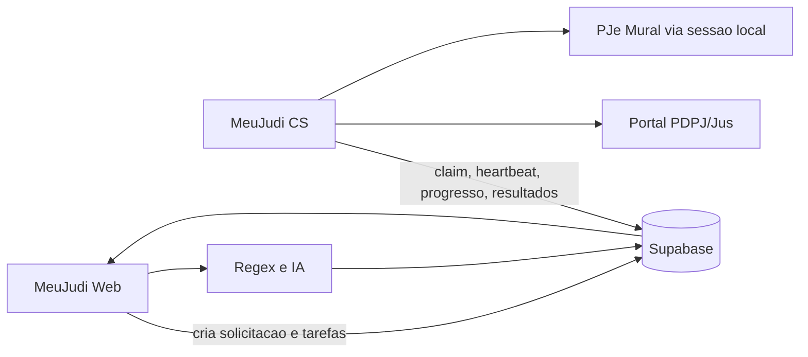

# MeuJudi CS 0.3.0 - Refatoracao do aplicativo e sincronizacao unificada

## 1. Objetivo

Este documento define a refatoracao completa do MeuJudi CS para a versao
0.3.0. A versao deve transformar o aplicativo de um conjunto de telas tecnicas
e rotinas parcialmente locais em um agente desktop operacional, visualmente
claro e integrado ao motor unificado de extracao do MeuJudi.

O CS continuara sendo um aplicativo Electron instalado no computador do
escritorio. Ele sera responsavel por executar consultas que dependem da sessao
local do usuario, enviar os resultados ao Supabase e informar o progresso real
da operacao. O Web continuara sendo o produto principal para o advogado.

Esta refatoracao nao e apenas uma mudanca de cor ou de layout. Ela reorganiza:

- navegacao;
- estados de conexao e autenticacao;
- fila de tarefas;
- sincronizacao Mural/PDPJ;
- progresso e retomada;
- diagnostico e logs;
- contratos entre CS, Web e Supabase;
- empacotamento e atualizacao do instalador.

## 2. Decisoes ja definidas

### 2.1 Fontes e responsabilidades

O fluxo nao utilizara PJe. A nomenclatura visivel do aplicativo deve deixar de
usar "PJe" e passar a usar "Portal PDPJ", "Jus.br" ou "PDPJ/Jus", conforme o
contexto.

| Camada | Responsabilidade |
| --- | --- |
| MeuJudi Web/Vercel | orquestracao do produto, Regex, IA, regras de negocio, consolidacao e telas do tenant |
| MeuJudi CS | autenticacao local, consultas Mural/PDPJ, paginacao, fila de tarefas e envio dos resultados |
| Supabase | fila persistente, progresso, resultados, textos, metadados, auditoria e RLS |

O DataJud permanece como adaptador do motor unificado no Web/Vercel, salvo se
uma necessidade operacional futura exigir uma tarefa local. O CS nao deve
assumir uma responsabilidade nova apenas porque a origem tambem participa da
sincronizacao do processo.

### 2.2 Dados locais

Nenhum dado processual deve depender de arquivo local. O CS pode guardar apenas
o que e necessario para manter a sessao autenticada:

- cookies e tokens do Portal PDPJ/Jus, criptografados pelo sistema operacional;
- identificador do dispositivo e do pareamento;
- preferencias locais de janela e notificacao;
- cache curto de interface, sem valor processual.

Nao devem permanecer como fonte oficial local:

- snapshot de processos;
- PDF original;
- fila definitiva;
- resultado de Regex ou IA;
- textos processuais permanentes;
- progresso de sincronizacao.

O PDF original nao sera enviado para o MeuJudi. O CS enviara metadados, link
oficial e, quando permitido, texto extraido. O advogado baixara o documento
diretamente para o proprio computador.

### 2.3 Regex e IA

Todos os Regex ficam no Web/Vercel, seguindo o padrao ja usado pelo Mural em:

- `src/lib/regex/patterns.ts`;
- `src/lib/mural/processar-comunicacao.ts`;
- `src/lib/mural/extrair-metadados.ts`.

O CS nao interpreta se um texto representa prazo, audiencia, decisao ou valor.
Ele coleta e entrega o dado bruto necessario, com metadados de origem. O Web
normaliza, executa Regex, chama IA quando necessario, salva evidencias e
atualiza o processo.

## 3. Diagnostico do CS atual

### 3.1 O que ja existe

O aplicativo atual ja possui partes importantes:

- Electron com processo principal, preload e renderer Next.js;
- pareamento com o tenant;
- cliente e extrator PDPJ;
- cliente e sincronizacao do Mural;
- diagnostico e envio para Supabase;
- armazenamento local criptografado da sessao;
- scheduler e reporter de status;
- tela de conexao, OAB, pareamento e progresso do Mural;
- instalador Windows via electron-builder.

Pontos de entrada atuais relevantes:

- `meujudi-cs/src/main/pdpj-api.ts`;
- `meujudi-cs/src/main/pdpj-extractor.ts`;
- `meujudi-cs/src/main/mural-client.ts`;
- `meujudi-cs/src/main/mural-sync.ts`;
- `meujudi-cs/src/main/pairing.ts`;
- `meujudi-cs/src/main/status-reporter.ts`;
- `meujudi-cs/src/main/supabase-reporter.ts`;
- `meujudi-cs/src/main/diagnostic.ts`.

### 3.2 Gaps que a 0.3.0 precisa resolver

1. A fila atual em `src/main/task-queue.ts` usa `electron-store`; ela deve
   deixar de ser a fila oficial e passar a ser, no maximo, um buffer de
   emergencia para uma queda momentanea de rede.
2. O renderer ainda usa `usePJeStatus`, `pje:*` e uma rota chamada
   `settings/pje-connection`; a nomenclatura deve ser migrada para PDPJ/Jus.
3. A home concentra conexao, extracao, Mural, diagnostico e logs em um unico
   fluxo, dificultando entender o que esta acontecendo.
4. O status de conexao com o MeuJudi Web, login PDPJ, sessao API e fila de
   sincronizacao sao estados diferentes, mas ainda aparecem misturados.
5. O progresso precisa sobreviver a fechar a janela, reiniciar o CS e trocar
   de computador apenas quando o pareamento for refeito; o historico oficial
   deve vir do Supabase.
6. O app precisa informar claramente quando esta aguardando login, limite da
   fonte, rede, resposta do Web ou processamento de uma tarefa filha.
7. Diagnostico e logs precisam ser navegaveis, filtraveis e exportaveis sem
   expor cookies, tokens, CPF ou conteudo sensivel desnecessario.
8. O fluxo de atualizacao do instalador precisa identificar a versao 0.3.0,
   validar a migracao e manter compatibilidade com pareamentos existentes.

## 4. Arquitetura alvo da versao 0.3.0



### 4.1 Processo principal

O processo principal do Electron controla:

- janela principal;
- tray;
- ciclo de vida;
- sessao local criptografada;
- worker da fila;
- clientes PDPJ e Mural;
- IPC seguro;
- notificacoes;
- atualizacao do aplicativo.

### 4.2 Preload

O preload deve expor uma API pequena e sem acesso direto a Node no renderer.
Os grupos devem ser reorganizados para refletir o produto:

```text
window.meujudi.connection
window.meujudi.pairing
window.meujudi.sync
window.meujudi.pdpj
window.meujudi.mural
window.meujudi.queue
window.meujudi.diagnostic
window.meujudi.app
```

Os canais antigos `pje:*` devem ser mantidos temporariamente apenas como
aliases internos de compatibilidade. Eles nao devem continuar aparecendo na
interface e devem ser removidos ao final da migracao.

### 4.3 Renderer

O renderer deve ser dividido em um shell compartilhado e paginas independentes.
Cada pagina consulta dados pelo preload e nunca acessa tokens ou Supabase
diretamente.

## 5. Modelo de sincronizacao no CS

O Web cria uma sincronizacao unificada. Para o usuario existe uma acao:
"Sincronizar agora". Internamente, o Web cria etapas independentes que podem
rodar em paralelo ou em sequencia:

```text
Sincronizacao unificada
  +-- DataJud
  +-- Mural via CS
  +-- PDPJ leve
       +-- detalhes de CNJ
       +-- movimentacoes
       +-- documentos e links
       +-- textos selecionados
```

O CS assume somente as etapas que dependem de sua sessao local. O resultado de
cada etapa e enviado assim que estiver pronto; o Web mostra progresso parcial
sem esperar todas as fontes terminarem.

### 5.1 Frequencias

As frequencias da politica de sincronizacao unificada permanecem:

- ciclo rapido: aproximadamente a cada hora para urgencias, novos processos,
  comunicacoes e prazos/audiencias proximos;
- ciclo operacional: aproximadamente a cada seis horas para processos ativos,
  movimentacoes e alteracoes recentes;
- ciclo longo: diario ou semanal para documentos, textos, reconciliacao e
  historico;
- sincronizacao individual: imediata e prioritaria.

DataJud e PDPJ pertencem ao mesmo ciclo logico, mas nao precisam bloquear um ao
outro. DataJud pode demorar mais e deve ter seus lotes e cursores persistidos.

### 5.2 Tipos de extracao PDPJ

O CS deve suportar, na ordem:

1. OAB + UF para localizar processos;
2. CNJ para detalhes do processo;
3. movimentacoes novas;
4. documentos e metadados;
5. links oficiais e texto permitido;
6. reprocessamento de uma etapa falha;
7. historico de longo prazo.

Consulta por CPF/CNPJ fica registrada como funcionalidade futura e manual,
iniciada a partir do cadastro de um cliente. Ela nao entra na sincronizacao
automatica da 0.3.0.

## 6. Fila persistente e tarefas encadeadas

### 6.1 Fonte oficial

A fila oficial deve ficar no Supabase. O CS busca uma tarefa, reserva por lease,
executa, envia heartbeat e registra o resultado. Uma tarefa presa por queda do
CS deve voltar a ficar disponivel quando o lease expirar.

O `electron-store` nao deve continuar armazenando o conjunto completo de
tarefas. Durante a transicao, ele pode armazenar somente uma fila de envio
temporaria, com limite pequeno e descarte seguro apos confirmacao do Supabase.

### 6.2 Tarefa pai e tarefas filhas

Uma operacao longa deve ser dividida para permitir pausa, retry e prioridade:

```text
pdpj_oab
  +-- pdpj_cnj(A)
       +-- pdpj_detalhes(A)
       +-- pdpj_movimentacoes(A)
       +-- pdpj_documentos(A)
            +-- pdpj_texto_documento(1)
            +-- pdpj_texto_documento(2)
```

Cada filha deve possuir `parent_task_id`, `processo_id`, `source`, `cursor`,
`attempt`, `priority`, `lease_expires_at` e um idempotency key. Se uma filha
falhar, somente ela sera repetida. A tarefa pai recebe o resultado agregado.

### 6.3 Estados

Os estados canonicos sao:

- `pending`;
- `claimed`;
- `running`;
- `waiting_external`;
- `paused_login_required`;
- `paused_rate_limit`;
- `completed`;
- `completed_with_warnings`;
- `failed`;
- `cancelled`.

### 6.4 Prioridade

1. prazo proximo;
2. audiencia proxima;
3. solicitacao individual;
4. nova comunicacao do Mural;
5. processo novo;
6. alteracao de processo ativo;
7. documento recente;
8. historico;
9. reprocessamento nao urgente.

## 7. Contrato minimo com o Supabase

Os nomes finais devem respeitar as migrations existentes. A implementacao
deve conferir antes se uma tabela ja existe, evitando duplicar estruturas.

### 7.1 Fila e progresso

O modelo precisa contemplar:

- identificador da tarefa;
- tenant e dispositivo pareado;
- fonte e tipo;
- processo/CNJ e documento quando aplicavel;
- estado e prioridade;
- pai e dependencias;
- cursor/pagina/checkpoint;
- contadores recebidos, novos, atualizados e ignorados;
- inicio, ultima atividade e fim;
- lease e tentativa;
- erro seguro e codigo de erro;
- idempotency key.

### 7.2 Resultado enviado pelo CS

O payload deve separar:

- identificacao da tarefa;
- contexto de origem;
- dados canonicos encontrados;
- metadados da consulta;
- links oficiais;
- texto extraido, quando houver;
- cursor seguinte;
- contadores;
- avisos e erros parciais.

O CS nunca deve enviar bearer, cookie, certificado, senha ou segredo de
autenticacao no payload de resultado ou nos logs.

### 7.3 RLS e escopo

O dispositivo so pode ler e atualizar tarefas do tenant pareado. O servidor
deve validar o device token e o tenant antes de aceitar cada progresso. O CS
nao recebe permissao de super admin.

## 8. Navegacao e visual da 0.3.0

### 8.1 Objetivo de experiencia

O usuario deve abrir o CS e responder rapidamente a tres perguntas:

1. O dispositivo esta conectado ao MeuJudi Web?
2. As fontes necessarias estao autenticadas?
3. A sincronizacao esta trabalhando, aguardando algo ou com erro?

A interface deve ser operacional, clara e discreta. O CS fica na bandeja, entao
a janela nao deve parecer um segundo sistema juridico completo. Ela deve ser o
painel de saude e execucao da sincronizacao.

### 8.2 Shell visual

- sidebar fixa com logo MeuJudi CS e versao;
- indicador global de estado no topo;
- tenant e dispositivo pareado visiveis, sem tokens;
- area principal ampla, com cards de resumo e listas de tarefas;
- modo compacto para telas menores;
- notificacoes nao intrusivas para sucesso, pausa e erro;
- botoes com icones e texto curto;
- estados com contraste suficiente em claro e escuro;
- skeleton/loading coerente;
- nenhuma pagina deve depender de texto preto em fundo escuro ou texto claro em
  fundo claro.

### 8.3 Menu principal

| Rota | Funcao |
| --- | --- |
| `/` | Visao geral |
| `/sync` | Sincronizacoes |
| `/queue` | Fila de tarefas |
| `/sources/pdpj` | Portal PDPJ/Jus |
| `/sources/mural` | Mural |
| `/diagnostics` | Diagnosticos |
| `/logs` | Logs tecnicos |
| `/settings` | Configuracoes |
| `/about` | Sobre e versao |

As rotas podem continuar estaticas no renderer Next.js, mas devem compartilhar
o mesmo shell. A rota antiga `settings/pje-connection` deve redirecionar para
`/sources/pdpj` durante a transicao.

### 8.4 Visao geral

A home deve mostrar:

- status do MeuJudi Web;
- status do pareamento e nome do escritorio;
- sessao PDPJ/Jus: conectado, aguardando login ou expirada;
- Mural: disponivel, aguardando CS ou com erro;
- sincronizacao atual com barra de progresso;
- quantidade de tarefas pendentes, em execucao e com erro;
- ultima sincronizacao concluida por fonte;
- alertas que exigem acao;
- botoes "Sincronizar agora", "Abrir Jus.br" e "Ver detalhes".

Cada card deve abrir a pagina correspondente. Nenhuma informacao importante
deve ficar escondida em uma notificacao temporaria.

### 8.5 Pagina de sincronizacoes

Deve listar execucoes unificadas com:

- horario;
- tenant;
- fontes envolvidas;
- progresso geral;
- etapas concluidas;
- avisos;
- erro principal;
- acao para abrir detalhes;
- acao para retomar ou repetir quando aplicavel.

Uma sincronizacao pode estar parcialmente concluida. Isso deve aparecer como
"Concluida com avisos", nunca como sucesso total.

### 8.6 Pagina da fila

A fila deve ter filtros por estado, fonte, processo e prioridade. Cada item
mostra:

- tipo em linguagem simples;
- origem;
- processo ou OAB mascarada quando necessario;
- etapa atual;
- progresso;
- tentativa;
- proxima tentativa;
- motivo da pausa;
- horario de ultima atividade.

O usuario pode abrir os detalhes. Acoes destrutivas, como cancelar uma fila
inteira, precisam de confirmacao. O usuario nao deve editar cursor ou lease
manualmente.

### 8.7 Pagina Portal PDPJ/Jus

Deve separar claramente:

1. **Conexao do aplicativo**: o CS esta pareado e online.
2. **Login da fonte**: a janela tecnica foi autenticada.
3. **Sessao da API**: bearer/sessao validada e pronta para extracao.
4. **Extracao**: tarefas PDPJ executando ou aguardando.

O botao "Abrir Jus.br" deve abrir somente a janela autenticada quando houver
uma sessao tecnica ativa. O fluxo de login deve permanecer oculto apos a
autenticacao. A home e a tela publica de consulta nao devem abrir
automaticamente.

Quando a sessao expirar, a pagina deve informar a acao necessaria e pausar as
tarefas com `paused_login_required`. Depois do novo login, o usuario deve
conseguir retomar sem reiniciar a OAB inteira.

### 8.8 Pagina Mural

Deve mostrar:

- CS pareado;
- disponibilidade do Mural;
- solicitacoes pendentes, em execucao e concluidas;
- periodo consultado;
- paginas e comunicacoes recebidas;
- ultimas falhas;
- sincronizacao individual;
- sincronizacao historica em lotes.

O Mural continua dependente do CS conectado. A interface nao deve sugerir que
o Web consegue consultar diretamente um endpoint bloqueado.

### 8.9 Diagnosticos e logs

Diagnosticos devem ter uma pagina propria com resumo e detalhes por etapa:

- rede;
- pareamento;
- sessao PDPJ;
- acesso ao Mural;
- fila;
- Supabase;
- envio de resultados;
- versao do aplicativo.

Logs devem ter filtros por nivel, modulo, tarefa e intervalo. Mensagens devem
ser estruturadas e conter um correlation id. Segredos e dados pessoais devem
ser mascarados antes de exibir ou enviar.

## 9. Fluxos principais

### 9.1 Primeiro uso

1. usuario instala e abre o CS;
2. o CS registra o dispositivo sem criar permissao de tenant;
3. usuario informa o codigo gerado no Web;
4. o Web valida o usuario e o tenant;
5. o CS recebe device token escopado;
6. a home mostra o escritorio e as fontes disponiveis;
7. o usuario autentica o Portal PDPJ/Jus quando solicitado;
8. o CS informa que a sessao esta pronta ou aguardando validacao;
9. nenhuma extracao processual inicia antes das pre-condicoes necessarias.

### 9.2 Sincronizacao automatica

1. Web cria ou atualiza a sincronizacao unificada;
2. Supabase cria as tarefas por fonte;
3. CS online reserva as tarefas locais;
4. o worker executa Mural/PDPJ com limites da fonte;
5. cada pagina confirma cursor e contadores;
6. o resultado e enviado ao Supabase;
7. Web executa normalizacao, Regex, IA e distribuicao;
8. a sincronizacao recebe o estado final agregado.

### 9.3 Sessao expirada

1. fonte retorna 401/403 ou falha de validacao;
2. CS nao repete indefinidamente;
3. tarefa vira `paused_login_required`;
4. tarefas filhas dependentes ficam pausadas;
5. home mostra um alerta acionavel;
6. usuario faz login somente na janela tecnica;
7. CS valida a sessao;
8. tarefas retomam do ultimo checkpoint.

### 9.4 Queda ou fechamento do CS

1. heartbeat para;
2. lease expira no Supabase;
3. tarefa volta a `pending`;
4. outro CS autorizado do mesmo tenant pode assumir, quando permitido;
5. o cursor salvo evita repetir todo o lote;
6. a interface mostra a ultima atividade conhecida.

## 10. Fases de implementacao

As fases devem ser executadas uma por vez. A proxima so comeca depois dos
criterios de aceite da anterior estarem verdes.

### Fase 0 - Inventario, nomenclatura e contratos

**Objetivo:** preparar a migracao sem alterar o comportamento de producao.

**Entregas:**

- inventario de IPC, paginas, stores e jobs atuais;
- mapa de aliases `pje:*` para `pdpj:*`;
- contrato final de tarefa, progresso e resultado;
- lista de migrations existentes;
- matriz do que e local e do que vai para Supabase;
- registro dos campos que nao podem aparecer nos logs.

**Aceite:** nenhum contrato duplicado e nenhum segredo exposto em teste.

### Fase 1 - Shell visual e navegacao

**Objetivo:** criar a estrutura visual da 0.3.0 sem trocar ainda o executor.

**Entregas:**

- layout compartilhado;
- sidebar e topbar;
- rotas da tabela de navegacao;
- home com estados mockados e reais quando disponiveis;
- temas claro/escuro e contraste revisado;
- estados loading, vazio, erro, pausa e sucesso;
- redirecionamento das rotas antigas.

**Aceite:** todas as paginas abrem, o tray continua funcionando e nenhuma
operacao existente e perdida.

### Fase 2 - Camada de conexao e pareamento

**Objetivo:** separar Web, dispositivo, login de fonte e sessao API.

**Entregas:**

- novo modelo de status;
- preload `connection` e `pairing`;
- pareamento escopado por tenant;
- heartbeat visivel na home;
- renovacao e revogacao do device token;
- migracao segura do armazenamento local de sessao.

**Aceite:** fechar e reabrir o CS preserva o pareamento; desconectar revoga o
acesso; um tenant nao aparece em outro.

### Fase 3 - Fila persistente no Supabase

**Objetivo:** tirar a fila oficial do `electron-store`.

**Entregas:**

- client de claim/lease/heartbeat;
- estados canonicos;
- prioridades;
- tarefas pai/filha;
- retry com backoff;
- retomada por cursor;
- buffer local curto somente para entrega interrompida;
- tela de fila.

**Aceite:** reiniciar o CS nao perde tarefas; duas instancias nao executam a
mesma tarefa; a tarefa retomada continua do checkpoint.

### Fase 4 - Worker e sincronizacao unificada

**Objetivo:** ligar o worker aos ciclos rapido, operacional, longo e manual.

**Entregas:**

- scheduler sem duplicacao;
- sincronizacao individual prioritaria;
- agrupamento DataJud/PDPJ/Mural no mesmo ciclo;
- progresso agregado;
- limites por fonte;
- cancelamento e retomada;
- notificacao de etapa pendente.

**Aceite:** "Sincronizar agora" cria uma unica execucao visivel, mesmo com
varias tarefas internas.

### Fase 5 - Portal PDPJ/Jus

**Objetivo:** estabilizar autenticacao e coleta sem abrir telas indevidas.

**Entregas:**

- renomear modulos e hooks de PJe para PDPJ;
- janela tecnica somente para login;
- captura e renovacao segura da sessao;
- validacao separada do bearer/API;
- botao independente para abrir Jus.br;
- pausa `paused_login_required`;
- OAB automatica do escritorio pareado.

**Aceite:** sessao ja autenticada e reconhecida sem novo login; expiracao pausa
a fila; a home publica nao abre automaticamente.

### Fase 6 - Coleta PDPJ por OAB e CNJ

**Objetivo:** transformar a extracao existente em tarefas persistentes.

**Entregas:**

- OAB + UF com paginacao correta;
- normalizacao e deduplicacao de CNJ;
- tarefas de detalhes, movimentacoes e documentos;
- cursor separado e recuperavel;
- contadores de paginas e registros;
- sincronizacao automatica de CNJ novo ou alterado;
- sincronizacao individual.

**Aceite:** uma OAB grande pode ser pausada, retomada e concluida sem snapshot
processual local.

### Fase 7 - Mural via CS

**Objetivo:** migrar o Mural para o mesmo worker e a mesma observabilidade.

**Entregas:**

- tarefas de polling, push e historico;
- periodo em lotes;
- consulta individual por processo;
- status de bloqueio, rede e rate limit;
- resultados e progresso no Supabase;
- compatibilidade com Regex no Web.

**Aceite:** uma consulta manual feita no Web aparece na fila do CS e seu
resultado fica visivel depois de reiniciar o aplicativo.

### Fase 8 - Documentos, links e textos

**Objetivo:** entregar somente o material util para o Web.

**Entregas:**

- metadados e links oficiais;
- selecao de documentos relevantes;
- texto permitido sem PDF original;
- hash e deduplicacao;
- descarte de textos vazios, repetidos ou sem valor;
- envio ao pipeline de Regex/IA;
- evidencia de origem.

**Aceite:** o advogado consegue baixar pelo link oficial; nenhum PDF fica
armazenado pelo CS ou enviado ao Supabase.

### Fase 9 - Diagnostico, logs e observabilidade

**Objetivo:** tornar cada falha explicavel e acionavel.

**Entregas:**

- correlation id por sincronizacao e tarefa;
- logs estruturados e mascarados;
- diagnostico por etapa;
- historico de execucoes;
- exportacao de diagnostico sem segredo;
- notificacao e recuperacao guiada;
- integração com o painel de observabilidade do Super Admin.

**Aceite:** um erro 401, 403, 404, rate limit, timeout ou falha de envio mostra
causa, etapa, tentativa, proximo passo e identificador para suporte.

### Fase 10 - Testes de integracao e seguranca

**Objetivo:** validar o comportamento real antes do pacote 0.3.0.

**Entregas:**

- testes de contrato IPC;
- testes de fila e lease;
- testes de retomada;
- testes de paginacao PDPJ;
- testes Mural com resposta bloqueada;
- testes de expiracao de sessao;
- teste de isolamento tenant/device;
- teste de ausencia de PDF e segredo em disco/log/payload;
- teste visual das rotas em claro e escuro.

**Aceite:** `npm run lint`, `npm run typecheck`, `npm run test` e o build do
renderer passam; o instalador de teste funciona em uma maquina limpa.

### Fase 11 - Empacotamento e release 0.3.0

**Objetivo:** publicar a nova versao com rollback possivel.

**Entregas:**

- atualizar `package.json` para `0.3.0`;
- gerar instalador com nome e icone corretos;
- migration backward-compatible;
- release com changelog;
- verificacao de assinatura/hash do arquivo;
- canal de preview antes da producao;
- plano de rollback para 0.2.x;
- limpeza de artefatos antigos sem apagar a release publicada.

**Aceite:** instalar 0.3.0 sobre 0.2.x preserva pareamento e sessao quando
possivel, ou informa claramente quando novo login for necessario.

## 11. Criterios gerais de aceite

- o CS nao mostra PJe na navegacao nem nas mensagens novas;
- a home distingue Web, pareamento, PDPJ, Mural e fila;
- uma sincronizacao unificada e acompanhavel do inicio ao fim;
- o progresso persiste no Supabase;
- tarefas pequenas podem ser retomadas individualmente;
- DataJud e PDPJ aparecem no mesmo ciclo logico sem bloquear um ao outro;
- Mural continua dependente do CS conectado;
- Regex e IA continuam no Web;
- PDFs nao sao armazenados no CS nem no Supabase;
- cookies e tokens ficam somente criptografados localmente;
- erros de autenticacao pausam, em vez de gerar loop infinito;
- o Super Admin consegue acompanhar as etapas do motor unificado;
- tenant A nunca consegue ler ou executar a fila do tenant B;
- a interface e legivel em tema claro e escuro;
- o instalador, a bandeja, notificacoes e atualizacao continuam operacionais.

## 12. Documentos de referencia

- [CS: pareamento por tenant e sincronizacao real](19-cs-sync-multitenant.md)
- [Arquitetura de sincronizacao do Mural](arquitetura-sincronizacao-mural.md)
- [Cliente API PDPJ no CS](implementacao-cliente-api-pdpj-cs.md)
- [Motor unificado de extracao](20-motor-unificado-extracao.md)
- [Politica de sincronizacao unificada](21-politica-sincronizacao-unificada.md)
- [Extracao PDPJ e fila de tarefas](22-extracao-pdpj-e-fila-cs.md)
- [Auditoria do login e sessao PDPJ](auditoria-pdpj-login-e-sessao.md)

## 13. Regra de execucao do projeto

O trabalho deve seguir a ordem das fases. Nao iniciar uma fase nova enquanto a
anterior nao tiver:

1. codigo implementado;
2. migrations necessarias aplicadas;
3. testes de aceite executados;
4. comportamento visual verificado;
5. diagnostico documentado;
6. rollback conhecido.

A versao 0.3.0 somente deve ser considerada pronta quando o CS deixar de ser
um conjunto de adaptacoes locais e passar a funcionar como o executor
persistente, observavel e visualmente claro do motor unificado do MeuJudi.
